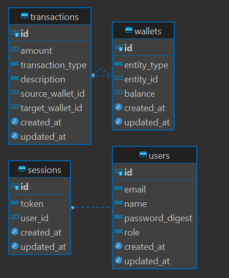

# Internal Wallet Transactional System

## Overview

This Ruby on Rails project implements an **Internal Wallet Transactional System** that allows users, teams, and stocks to manage their wallets and handle transactions such as credits, debits, and transfers. The system includes session-based authentication, secure password management, and integration with the **Latest Stock Price** API for fetching stock prices.

## Table of Contents

- [Features](#features)
- [Technologies Used](#technologies-used)
- [Getting Started](#getting-started)
- [Database Schema](#database-schema)
- [Authentication](#authentication)
- [API Endpoints](#api-endpoints)
- [Testing](#testing)
- [Contributing](#contributing)
- [License](#license)

## Features

- User authentication with session-based login/logout
- Secure password handling using `bcrypt`
- Polymorphic wallet system allowing Users, Teams, and Stocks to manage their wallets
- Support for credit, debit, and transfer transactions
- ACID-compliant transaction handling
- Integration with **Latest Stock Price** API to fetch real-time stock prices
- RESTful API endpoints for managing wallets, transactions, and user authentication

## Technologies Used

- **Ruby on Rails** - Web framework
- **PostgreSQL** - Database
- **BCrypt** - Secure password encryption
- **RapidAPI** - Stock price API integration
- **RSpec** (optional) - For testing

## Getting Started

### Prerequisites

- Ruby `3.0.0` or later
- Rails `6.1` or later
- PostgreSQL
- RapidAPI Account and API Key for stock price integration

### Installation

1. running docker:

   ```bash
   docker compose -up -d
   docker exec -it internal_wallet_api-rail-1 bin/runserver
   ```
   
2. access urls
    ```
   http://localhost:3000
   ```
   
## Database Schema
### Users
- **Table Name**: `users`
- **Columns**:
   - `id`: bigint (Primary Key)
   - `email`: varchar (Not Null)
   - `name`: varchar (Nullable)
   - `password_digest`: varchar (Not Null)
   - `role`: varchar (Nullable)
   - `created_at`: timestamp
   - `updated_at`: timestamp

---

### Wallets
- **Table Name**: `wallets`
- **Columns**:
   - `id`: bigint (Primary Key)
   - `entity_type`: varchar (Nullable)
   - `entity_id`: bigint (Nullable)
   - `balance`: numeric(10, 2) (Not Null, Default: 0.0)
   - `created_at`: timestamp
   - `updated_at`: timestamp

---

### Sessions
- **Table Name**: `sessions`
- **Columns**:
   - `id`: bigint (Primary Key)
   - `token`: varchar (Nullable)
   - `user_id`: bigint (Not Null, Foreign Key referencing `users(id)`)
   - `created_at`: timestamp
   - `updated_at`: timestamp

---

### Transactions
- **Table Name**: `transactions`
- **Columns**:
   - `id`: bigint (Primary Key)
   - `amount`: numeric(10, 2) (Not Null)
   - `transaction_type`: varchar (Not Null)
   - `description`: text (Nullable)
   - `source_wallet_id`: bigint (Nullable, Foreign Key referencing `wallets(id)`)
   - `target_wallet_id`: bigint (Nullable, Foreign Key referencing `wallets(id)`)
   - `created_at`: timestamp
   - `updated_at`: timestamp

---

### Relationships
- **Users** can have many **Sessions** (1-to-Many)
- **Wallets** can be associated with **Users** (via entity_type and entity_id)
- **Transactions** have a **source_wallet** and a **target_wallet** (both are Foreign Keys referencing **Wallets**)

---

### ERD Diagram



## Authentication

The system uses a **session-based authentication mechanism** to manage user access securely. This means that users log in with their credentials, and a session is created to manage their access while interacting with the system.

### How It Works

1. **User Login**:
  - Users log in by sending their `email` and `password` to the `POST /login` endpoint.
  - Upon successful authentication, the server creates a session by storing the user’s ID in the `session` object (`session[:user_id]`).
  - The session ID is then stored on the client, allowing the user to be authenticated for subsequent requests.

2. **Authenticated Requests**:
  - For any request requiring authentication, the system checks for a valid `session[:user_id]`.
  - If the session is valid, access is granted; otherwise, an "Unauthorized access" error is returned.

3. **User Logout**:
  - When a user logs out via the `DELETE /logout` endpoint, their session is destroyed (`session[:user_id] = nil`), and they need to log in again to access protected resources.

### Security Considerations

- **Session Storage**: The session ID is stored in a cookie, while the actual user data is securely managed on the server.
- **Password Security**: The system uses `bcrypt` to encrypt passwords, ensuring they are stored securely.
- **SSL/TLS Encryption**: It's recommended to use HTTPS in production to protect session data and credentials during transmission.

### Example Workflow

1. **Login Request**:
   ```bash
   curl -X POST http://localhost:3000/login \
   -H "Content-Type: application/json" \
   -d '{
     "email": "john.doe@example.com",
     "password": "password123"
   }'


## API Endpoints

### Transactions Transfer / Credit / Debit Funds

**Endpoint**: `POST /transactions`

**Description**: Transfers a specified amount from the authenticated user's wallet to another wallet.

**Request Headers**:
- `Content-Type: application/json`
- `Cookie: sessionid=your_session_id`

**Request Body**:
```json
{
  "transaction_type": "transfer/credit/debit",
  "target_wallet_id": 2, // optional for credit/debit
  "amount": 50.0,
  "description": "Payment for services"
}
```


**Response Body**:
```json
{
  "message": "Transfer successful",
  "transaction_id": 123,
  "source_wallet_id": 1,
  "target_wallet_id": 2,
  "amount": 50.0
}
```

### Check Balance
**Endpoint**: `GET user/balance`

**Description**: Show current balance.

**Request Headers**:
- `Content-Type: application/json`
- `Cookie: sessionid=your_session_id`

**Response Body**:
```json
{
  "is_success": true,
  "account_name": "John Doe",
  "role": "user",
  "balance": "1350.0"
}
```

### Check History
**Endpoint**: `GET user/history`

**Description**: History for the balance.

**Request Headers**:
- `Content-Type: application/json`
- `Cookie: sessionid=your_session_id`

**Response Body**:
```json
{
  "is_success": true,
  "history": [
    {
      "id": 3,
      "amount": "50.0",
      "transaction_type": "transfer",
      "description": "Payment for services",
      "source_wallet_id": 1,
      "target_wallet_id": 2,
      "created_at": "2024-09-30T06:58:06.317Z",
      "updated_at": "2024-09-30T06:58:06.317Z"
    },
    {
      "id": 2,
      "amount": "50.0",
      "transaction_type": "transfer",
      "description": "Payment for services",
      "source_wallet_id": 1,
      "target_wallet_id": 2,
      "created_at": "2024-09-30T05:14:07.205Z",
      "updated_at": "2024-09-30T05:14:07.205Z"
    },
    {
      "id": 1,
      "amount": "50.0",
      "transaction_type": "transfer",
      "description": "Payment for services",
      "source_wallet_id": 1,
      "target_wallet_id": 2,
      "created_at": "2024-09-30T05:14:01.758Z",
      "updated_at": "2024-09-30T05:14:01.758Z"
    }
  ]
}
```

### Contributing
**Name**: `Wardi Fadillah`

**Email**: [wardi.fadillah@gmail.com](mailto:wardi.fadillah@gmail.com?subject=Internal%20Wallet%20Transactional%20System)

**Repo**: [GitHub](https://github.com/maskrebel/)